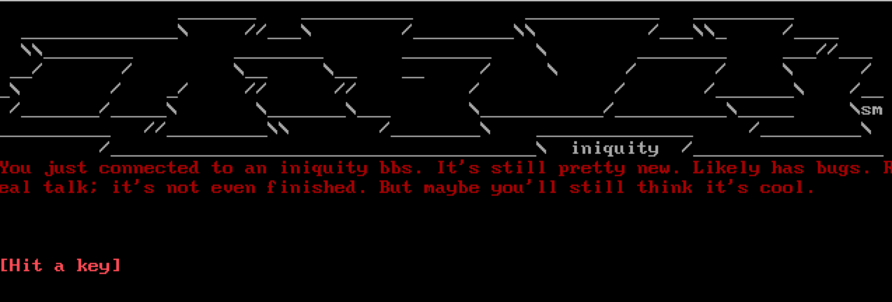
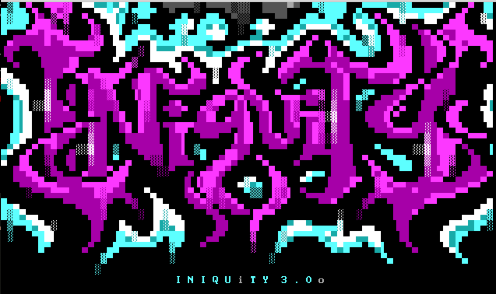

# Iniquity

This is the re-imagining of the iconic Iniquity Bulletin Board Software.

[](https://sonarcloud.io/dashboard?id=iniquitybbs_iniquity)
[](https://sonarcloud.io/dashboard?id=iniquitybbs_iniquity)
[](https://sonarcloud.io/dashboard?id=iniquitybbs_iniquity)
[](https://sonarcloud.io/dashboard?id=iniquitybbs_iniquity)
[](https://sonarcloud.io/dashboard?id=iniquitybbs_iniquity)
[](https://sonarcloud.io/dashboard?id=iniquitybbs_iniquity)

```js
/*
-$a. ------------------ .a$ ---------------------------- %$!, ----------------%
 `$¸   .%$$^¸$$aa.     .¸$`        .        .a$a$$.      `¸$%  $a$.        .
-.aaa$ $$$$'- $$$$$.- $aaa. -.a%$^"$$aa -- .$$$$$'- $$a. $aaa. `$,$ ----------%
;$$$$',a$a$  d$%$$$$$,'$$$$;$$$$$  $$$$$., $$%$$"  d$a$$ '$$$$; $$$   .a%$  $$a
:$$$$;$$$$%; Z$$$$$$$$;$$$$:$$$$$. $$$$^$,;$$&$$   Z$$$$,;$$$$.a$$$a..$$$   $$$
.$$$$ `$$$$.  $$$%$$$' $$$$.`$$$$  $$%$$$$ `$$$$.   $%$$$ $$$$""$$$" $$$$:  a$$
 `$$$a.$$%$   $$$$$$';a$$$`  `¸$$aa$$$$&$': `$$$$a. $$$$'a$$$`.$$'$  $$$$;  $$$
%-----.------ $$$$'--------------- $$%$$' -- `¸$$$$$%$¸' ---- $$¸$a. `"$&$$//$%$
dz      .   .:'¸'     .        .   $$$$'     .        .       `¸$$$$y.     `$$&
%--------- a`-----------.--------- $$¸' -----.------------.---------------- $$$
   .      !a    . .    .      .   .:'   .  .                  .        .:.a$$$¸
.      .  '$a,          .        a` .   'a          .   .             s` .  . .
      .    ¸$Aa         .       !a       a!      .    .         ..   %s      .s
   .         ¸¸'     . .        '$$Aa.aA$$'        . .               `!$%a.a%//$
==============================================================================
   t h e    i n i q u i t y    b u l l e t i n   b o a r d   s y s t e m
==============================================================================
*/
```

## Introduction

### Some guidng thoughts surrounding the idea of a new Iniquity BBS

-   A BBS software that is geared more towards developers and modders.
-   Make it easy for sysops to develop and deploy BBS applications.
-   Easily network files, messages and other forms of communication between other BBS applications.
-   What you see in xterm, NetRunner, SyncTerm, EtherTerm or qodem is what you see in a web browser.
    -   Though the ability to do interesting things specific to terminal/web should exist.

## Getting started

### Your development environment should contain something like this, or similar

-   macOS / Windows / Linux _required_
    -   These modern operating systems are currently supported.
-   Docker Desktop for macOS / Windows or Docker Machine _required_
    -   The Iniquity BBS runtime is executed inside of a Docker container for portability.
-   Node.js & NPM _required_
    -   The Node community tools are used for TypeScript transpiling and Iniquity package management.
-   Visual Studio Code _recommended_
    -   This repository is specifically tuned to take full advantage of this IDE.
-   Moebius _recommended_
    -   The ideal choice for working with ANSI/ASCII/PETSCII/AMIGA artwork.

### Install Iniquity using npm

```bash
npm install https://github.com/iniquitybbs/iniquity.git
```

## Initialize your current working directory as a new Iniquity system

```bash
iniquity init
```

## Start the system

```bash
iniquity start
```

## Using your favorite terminal client or web browser, connect to localhost using standard ports

```bash
iniquity term localhost
```

or...

```text
Go to http://localhost in your favorite web browser
```

### Developing an Iniquity application

#### A welcome experience for connecting users

```typescript
const bbs = new BBS()

bbs.renderArtwork({
    file: "assets/sm!iniq2.ans",
    clearScreenBefore: true
})

bbs.say(
    "You just connected to an iniquity bbs. It's still pretty new. Likely has bugs. Real talk; it's not even finished. But maybe you'll still think it's cool."
        .newlines()
        .color("red")
        .center()
)
bbs.pause({ newlines: 2, center: true })
```



#### Have it present some larger artwork, and end with prompting the user to pause

```typescript
bbs.renderArtwork({
    file: "assets/zv_iniq.ans",
    clearScreenBefore: true,
    speed: 60
})

bbs.pause({ newlines: 2, center: true })
```



#### Begin to describe a simple login or new user application process

```typescript
bbs.renderArtwork({
    file: "assets/artwork/we-iniq3.ans",
    clearScreenBefore: false
})

bbs.say("You've connected to a prototype of the new Iniquity BBS Development Platform.".newlines(2).color("bright red").center())

let login = bbs.ask("What's your username?".newlines(1).color("green"))
if (login) {
    switch (login) {
        case "new":
            bbs.renderArtwork({
                file: "assets/artwork/newuser.ans",
                clearScreenBefore: false
            })

            bbs.ask("What would you like your handle to be?".newlines(2).color("white"))
            break
        default:
            bbs.say(`Hey ${login} thanks for signing in, let's move on to the next menu...`.newlines().color("white").center())

            bbs.renderArtwork({
                file: "assets/artwork/we-iniq3.ans",
                clearScreenBefore: false
            })

            bbs.say("Now that we know who you are, let's see if you can input the right password...".newlines().color("green").center())

            let password = bbs.ask("Your password".newlines().color("white"))
            if (password) {
                bbs.say("Nice work entering a good password...".newlines().color("white"))
            }

            bbs.renderArtwork({
                file: "assets/artwork/4d-iniq1.ans",
                clearScreenBefore: true
            })

            break
    }
}
```


#### You get the idea. Additionally, you could enhance your Iniquity application using modules

```bash
iniquity install filesharing messaging
```

## Discord

[Iniquity Discord Server](https://discord.gg/UsyvrSZ)

## Issues

[Iniquity Feedback, Ideas, Bugs](https://github.com/iniquitybbs/iniquity/issues)
